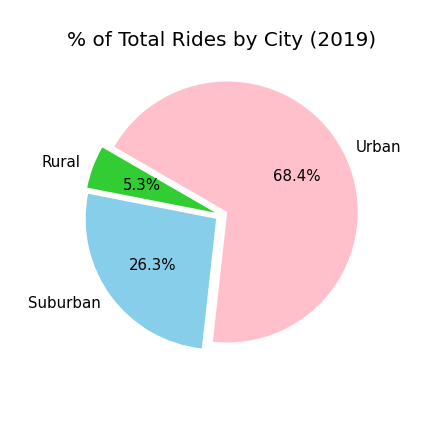
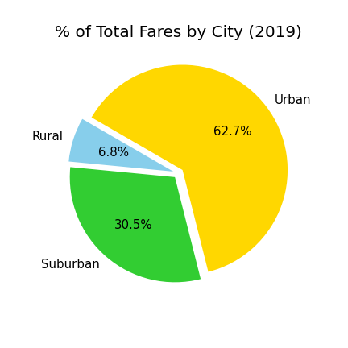
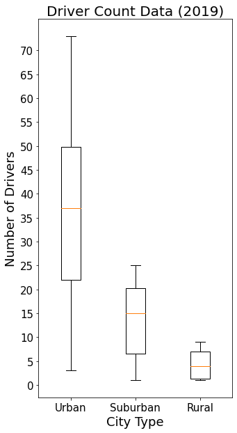
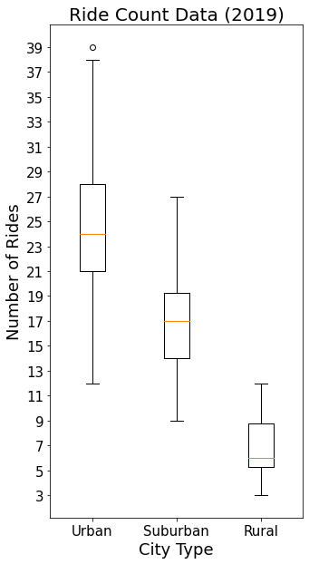

# PyBer_Analysis

## Project Overview
Analysis of ride-sharing data to showcase the drivers, riders, and fare by city type. The trends and visualizations are to inform decisions that improve access to ride-sharing services and determine affordability for underserved neighborhoods.

### Resources:
 - Data: city_data.csv and ride_data.csv
 - Software: Python 3.7.13, Pandas 1.3.5, Numpy 1.21.5, matplotlib 3.5.1, jupyter notebook (notebook server 6.4.8, Ipython 7.31.1)

## Summary 
The data includes:
 - 120 Cities, 2375 Rides, cost of the ride(fare), date & time of each ride (January 1, 2019 to May 8, 2019),  the unique ride id's, total drivers per city and no null/NaN values.

 - Visualizations will be by city type because there are too many cities (and neighborhoods) to visualize together and maintain their sense of being unique, without feeling crowded, messy and hard to read.
 

## Results:
### Barebones Summary Table

### Most of the ride-share activity is in urban cities and neighborhoods. 

  
  
  

### Summary of the Datapoints

  
  
  

- The further away you get from the urban areas, the fewer riders and drivers, and a general increase in fares. 
## Trends:
#### Ride-Share Access

  - The more drivers there are in an area increases the access to ride-sharing.
  - The increased access results in more rides.

#### Average Fare

  - Urban area fare price is hovering around $25.
  - The average fare in Urban areas seems stable when compared to that of rural areas.
  - Having more drivers available stablizes the fare price.
  - Suburban area fares are less chaotic and more predictable than rural fares. 

#### Total Weekly Rides

  - Based on the number of rides, the Urban area fare price seems to be the affordable price. 

#### Total Weekly Fare

  - These last two graphs look nearly identical.
  - More money can be made if you have a lower average fare and increase your number of rides: Urban's $25 vs Rural's $33 to $38. 

## Ending Analysis
- Having a stable and mostly predictable price will increase your repeat customer usage.
- You need to recruit more drivers:
  - Urban areas: 
    - most of the revenue is here, who needs a car when you can ride-share.
  - Suburban areas: 
    - mostly to increase access and spreading the word about the service. I would like to see whether or not the affordable price for suburban areas is the same as urban areas.
  - Rural areas: 
    - to stablize the price.  I suspect the affordability in rural areas may be a closer to $30.
- Question in regards to the Suburban and Rural areas:
  - Why should you recruit more drivers in areas where there is little or no customer base? 
     - Answer: You will not have customers, if you do not have drivers; more drivers means more access to the service and higher chance of getting riders. 

## Challenge
Pyber.ipynb is the initial analysis, Pyber_Challenge.ipynb is a copy of Pyber.ipynb and expanded to include time series graphs. 