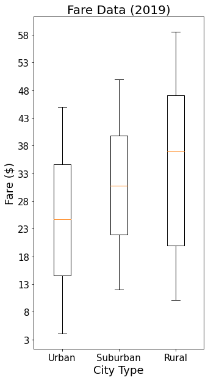
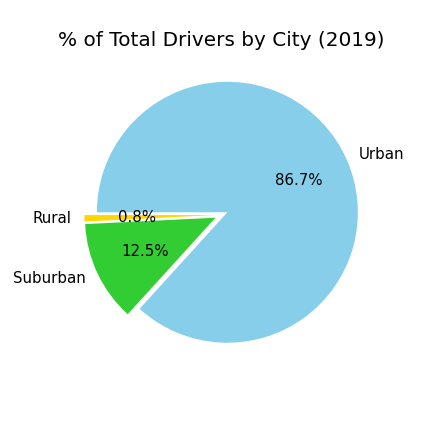

# PyBer_Analysis

## Project Overview
Analysis of ride-sharing data to showcase the drivers, riders, and fare by city type. The trends and visualizations are to inform decisions that improve access to ride-sharing services and determine affordability for underserved neighborhoods.

### Resources:
 - Data: city_data.csv and ride_data.csv
 - Software: Python 3.7.13, Pandas 1.3.5, Numpy 1.21.5, matplotlib 3.5.1, jupyter notebook (notebook server 6.4.8, Ipython 7.31.1)

## Summary 
The data includes:
 - 120 Cities, 2375 Rides, cost of the ride(fare), date & time of each ride (January 1, 2019 to May 8, 2019),  the unique ride id's, total drivers per city and no null/NaN values.

 - I  will be visualizing the cities by city type because there are too many cities to visualize together and maintain their sense of being unique, without feeling crowded, messy and hard to read.
 

## Results:

  
  
  

  
  
  

## Challenge Background
Create a multiple-line graph that shows the total weekly fares for each city type. Finally, you’ll submit a written report that summarizes how the data differs by city type and how those differences can be used by decision-makers at PyBer.

